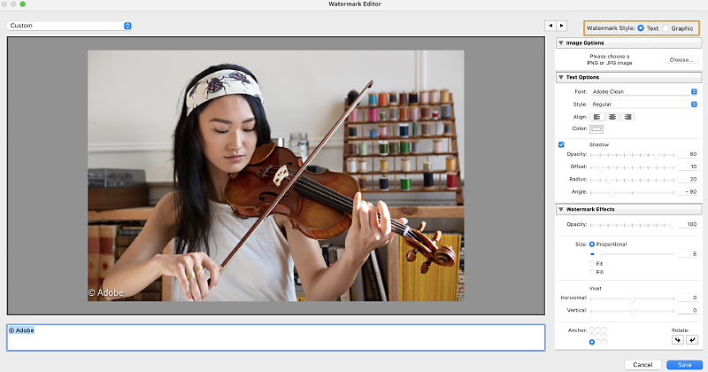

# Lightroom Classic에서 사진에 워터마크 만들기

중요:

이 문서에서는 Lightroom Classic의 작업 과정에 대해 설명합니다. Lightroom desktop 사용?그래픽 및 서명 워터마크 추가를 참조하십시오.

## 저작권 워터마크 만들기

1. 아무 모듈에서나편집>워터마크 편집(Windows) 또는Lightroom Classic>워터마크 편집(macOS)을 선택합니다.
2. 워터마크 편집기대화 상자에서워터마크 스타일:텍스트또는그래픽을 선택합니다.Lightroom Classic의 텍스트 워터마크 설정.Lightroom Classic의 텍스트 워터마크 설정.
3. 다음 중 하나를 수행합니다.(텍스트 워터마크) 미리 보기 영역 아래에 텍스트를 입력하고 글꼴, 스타일, 맞춤, 색상 및 그림자 등의텍스트 옵션을 지정합니다. OpenType 글꼴은 지원되지 않습니다.(그래픽 워터마크) [이미지 옵션] 창에서선택을 클릭한 다음 사용할 PNG 또는 JPEG를 선택합니다.
4. 워터마크 효과를 다음과 같이 지정합니다.불투명도워터마크의 투명도 수준을 조정합니다.크기비율은 워터마크를 더 크게 또는 더 작게 확대/축소합니다.
  맞춤은 사진 폭에 맞게 워터마크 크기를 조정합니다. 채움은 사진의 높이와 폭을 채우도록 워터마크 크기를 조정합니다.삽입사진에서 워터마크 위치를 수평 또는 수직으로 조정합니다.기준사진에서 워터마크를 9개의 기준점 중 하나에 고정하고 워터마크를 왼쪽 또는 오른쪽으로 회전합니다.참고:최종 이미지에서 워터마크를 보는 데 문제가 있을 경우 사진에서 크기를 더 크게 하거나 위치를 다르게 해 보십시오.
5. 저장을 클릭합니다.

## 저작권 워터마크 관리

* 아무 모듈에서나편집>워터마크 편집(Windows) 또는Lightroom Classic>워터마크 편집(macOS)을 선택합니다.
* 필름 스트립에서 여러 사진을 선택한 경우 [왼쪽]및 [오른쪽]내비게이션 화살표 단추를 클릭하여 각 사진의 워터마크를 미리 봅니다.
* 현재 설정을 사전 설정으로 저장하고워터마크 편집기를 종료하려면저장을 클릭합니다. 워터마크를 저장하고 워터마크 편집기에서 작업을 계속하려면 [사전 설정] 메뉴(창의 왼쪽 위 모서리에 위치)를 클릭하고현재 설정을 새 사전 설정으로 저장을 선택합니다. [새 사전 설정] 대화 상자에 이름을 입력하고만들기를 클릭합니다.
* 워터마크를 선택하려면 창의 왼쪽 위 모서리의 사전 설정 메뉴에서 선택합니다.
* 워터마크를 편집하려면 사전 설정 메뉴에서 워터마크를 선택하고 설정을 변경합니다. 그런 다음 사전 설정 메뉴를 다시 클릭하고 [사전 설정 "[이름]" 업데이트]를 선택합니다.
* 저작권 워터마크 이름을 바꾸려면 사전 설정 메뉴에서 해당 이름을 선택한 다음 메뉴를 다시 클릭하고 [사전 설정 "[이름]" 이름 바꾸기]를 선택합니다.
* 저작권 워터마크를 삭제하려면 사전 설정 메뉴에서 해당 이름을 선택한 다음 메뉴를 다시 클릭하고 [사전 설정 "[이름]" 삭제]를 선택합니다.

## 저작권 워터마크를 이미지에 적용

사진에 저작권 워터마크를 적용하는 방법에 대한 자세한 내용은 다음을 참조하십시오.

* 디스크 또는 CD로 파일 내보내기
* 슬라이드 쇼에서 저작권 워터마크 표시
* 저작권 워터마크를 표시하여 사진 인쇄
* 웹 사진 갤러리에 저작권 워터마크 표시

### 관련 항목 더보기

* 사진을 공유하는 동안 텍스트 워터마크 추가 | 모바일용 Lightroom(Android)
* 사진을 공유하는 동안 텍스트 워터마크 추가 | 모바일용 Lightroom(iOS)
* 사진 플래그 표시, 레이블 및 등급 지정
* 온라인으로 사진 게시

---
## 문서 내 참조된 이미지 목록

### 이미지: Lightroom Classic 워터마크 설정

[원본 이미지 보기](https://helpx-prod.scene7.com/is/image/HelpxProd/Lightroom-watermark?$png$&jpegSize=200&wid=800)
---